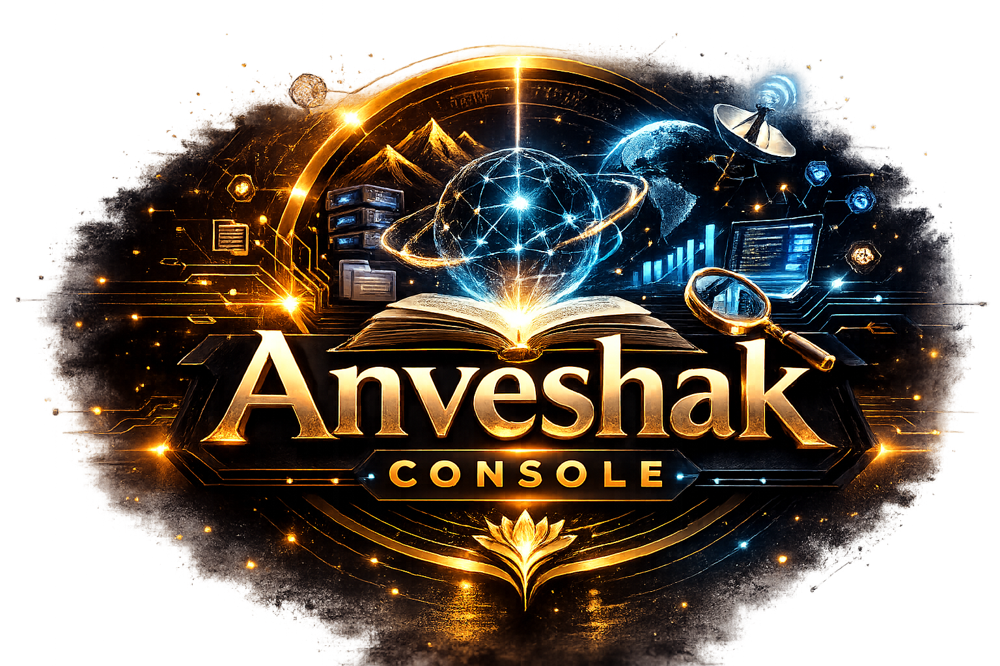

<p align="center">
  
</p>

# Anveshak Console
## Open-source models that use Internet and have long-context memory

> Private multimodal reasoning with local memory and live retrieval.
>
> TL;DR: A private multimodal research console for local reasoning, live web retrieval, long-term memory, and API-style workflows.

<p align="center">
  <video src="https://github.com/user-attachments/assets/f1beda5d-0af0-4594-8ba0-0d97fc579f56" autoplay loop muted playsinline controls width="100%"></video>
</p>

<p align="center">
  <a href="https://www.youtube.com/watch?v=qFrBSUA1BPo">Watch the demo on YouTube</a>
</p>

Anveshak Console is a local-first research assistant built for serious private workflows. It runs open multimodal models on your own machine, keeps memory and files on disk that you control, retrieves fresh web evidence during a run, and exposes the whole stack as readable Python instead of hiding the system behind a managed service.

Important patience note: starting a run, loading a very large model, unloading it, or exiting the application can take a couple of minutes on real hardware. The system is doing local preparation and cleanup work rather than handing those costs to a hosted backend, so brief waiting during startup or shutdown is expected.

## Why This Project Matters

Serious research work often involves unpublished notes, drafts, PDFs, experiments, and iterative reasoning traces that should not leave your machine. Anveshak Console is designed for that boundary: local model execution, local file access, local memory, live retrieval, and a clean interface that still feels practical for day-to-day use. Its API-call layer also makes it easier to build controlled interfaces around local open-source models, which creates a clearer path for direct comparison between open models that do not natively ship with internet capabilities and closed-source systems that do.

## What It Does

- Runs large open Hugging Face models locally, with `Qwen/Qwen3.5-122B-A10B-GPTQ-Int4` as the default reasoning model.
- Uses live web retrieval during a run instead of answering from stale model weights alone.
- Maintains long-term memory in `context_window/` and resets it with `Obliviate`.
- Reads local files, direct file paths, and browser uploads without shipping them to a hosted service.
- Supports browser chat, terminal chat, drag-and-drop attachments, microphone capture with editable Whisper transcription, inline steering, and saved API-style call presets.
- Lets each browser prompt choose `No Internet`, `Auto`, or `Searching the Web`, plus `Safe` or `Unrestricted` inline web media.
- Shows inline web images and videos in chat when live retrieval finds relevant results.
- Renders assistant responses as Markdown by default, with per-message `MD` / `TXT` switching and LaTeX support.
- Includes a builder-driven API layer with generated keys, saved runtime snapshots, optional user-context reuse, and optional per-call remembered history.
- Unlocks the chat as soon as the answer is finished, while long-term memory compression continues safely in the background.
- Refreshes the ambient local-file index in the background instead of blocking prompt submission.
- Ships as an installable Python package with the `anveshak` command.
- Writes per-run structured logs in `logs/` and starts reproducibly with `--seed`.
- Automatically checks `HUGGINGFACE_HUB_TOKEN` for gated Hugging Face models and, if a gated download still needs auth, prompts for the token in the browser UI instead of hard-failing silently.

## How It Works

Anveshak is built from a small set of explicit subsystems rather than one monolithic black box.

- `runtime.py`
  Prepares checkpoints, stages local assets, tracks runtime status, and exposes progress to the UI.
- `chat/service.py`
  Orchestrates each run end to end: attachments, retrieval, generation, steering, API calls, sessions, and background memory writes.
- `modeling/factory.py`, `modeling/qwen_runner.py`, and `modeling/kimi_server_runner.py`
  Choose the right backend for each model family and expose one common reasoning interface for streaming generation, JSON generation, search planning, and memory summarization.
- `retrieval/`
  Implements the full retrieval stack: local workspace indexing, explicit file-path retrieval, live web retrieval, and persistent long-term memory retrieval.
- `static/`, `server.py`, and `terminal.py`
  Expose the same local system through the browser UI, FastAPI endpoints, SSE streams, and a terminal REPL.
- `api_calls.py`
  Persists reusable API workflows with generated keys, model snapshots, response mode, web policy, user-context policy, and invocation-memory policy.

## Retrieval And Memory Pipeline

The system is practical because the model is not left alone with only its weights.

1. Attachments are normalized and classified as images, videos, documents, or unsupported binary files.
2. Clicking the microphone starts background Whisper warm-up, and recorded microphone clips are transcribed into editable chat text before retrieval and answering continue.
3. Documents are parsed into text and, when supported, extracted visuals or page previews.
4. Video-capable models receive native video attachments, while image-only multimodal models receive a sampled set of fallback video frames with a reliability warning in chat.
5. The local workspace index refreshes in the background when enabled, and attached documents are indexed into the retrieval store immediately.
6. Explicit local paths mentioned in the prompt are pulled into the highest-priority file context.
7. Long-term memory notes are retrieved from `context_window/memory/`.
8. The system decides whether to use the internet, or follows the user's explicit web-mode choice.
9. Active web retrieval gathers fresh evidence, chunks it, embeds it, and ranks it.
10. When applicable, Anveshak also curates inline web image or video previews using `Safe` or `Unrestricted` mode.
11. The model-specific adapter composes a grounded prompt from attachments, local files, web evidence, long-term memory, and recent conversation turns.
12. The answer streams back to the UI with citations, and any curated web media appears underneath it in chat.
13. After the answer is already finished and the chat is unlocked, the exchange is compressed into durable long-term memory in the background.

This split is important: the recent conversation is available immediately through the normal context window, while the durable memory note is written asynchronously so the next turn does not have to wait.

## Install

Recommended for GPU users:

```bash
conda create -n anveshak python=3.12
conda activate anveshak
python -m pip install --upgrade pip setuptools
python -m pip install --ignore-installed torch torchvision --index-url https://download.pytorch.org/whl/cu128
python -m pip install -e .
```

If you also want the test extras:

```bash
python -m pip install -e .[test]
```

If you prefer the older dependency-file workflow:

```bash
python -m pip install -r requirements.txt
python -m pip install -e .
```

Notes:

- `torch` is declared as a package dependency, but GPU users should usually preinstall the CUDA wheel they want before installing Anveshak.
- `transformers` and `gptqmodel` are pinned to stable releases because `transformers` development snapshots have broken older remote-code model imports in practice.
- `einops`, `timm`, and `torchvision` are part of the supported multimodal dependency set and should be installed before trying InternVL, LLaVA, or similar VLM checkpoints.
- `gptqmodel` may compile extensions during install or first use.
- `openai-whisper` powers transcription. Browser-recorded microphone `.wav` clips are decoded directly in Python, so `ffmpeg` is not required for that mic path, but it is still recommended for broader Whisper compatibility with other audio formats.
- `PyMuPDF` is used for PDF text and visual extraction.

### Hugging Face Tokens For Gated Models

Most users do not need a Hugging Face token. Public checkpoints continue to work without one.

If you choose a gated or private Hugging Face model, Anveshak now checks `HUGGINGFACE_HUB_TOKEN` automatically during runtime preparation and uses it if it is available. `HF_TOKEN`, `HUGGINGFACE_TOKEN`, `HUGGING_FACE_HUB_TOKEN`, and `HUGGING_FACE_TOKEN` are treated as the same token too. If a gated model still cannot be accessed, the browser UI opens a token prompt with a retry button and links to Hugging Face's token-creation instructions.

Current shell only:

```bash
export HUGGINGFACE_HUB_TOKEN=hf_...
```

Persistent bash setup:

```bash
echo 'export HUGGINGFACE_HUB_TOKEN=hf_...' >> ~/.bashrc
source ~/.bashrc
```

If you already authenticate with `hf auth login`, Anveshak still honors that path too. The documented primary env var in this project is `HUGGINGFACE_HUB_TOKEN`, but the standard `HF_TOKEN` and the compatibility aliases above are treated equivalently.

## Run

Web UI:

```bash
anveshak web --open-browser
```

Terminal mode:

```bash
anveshak terminal
```

Browser and terminal together:

```bash
anveshak both --open-browser
```

Legacy source-checkout launch still works:

```bash
python -W ignore main.py --mode web --open-browser
```

## Useful Arguments

```bash
anveshak web \
  --workspace-root . \
  --model-id Qwen/Qwen3.5-122B-A10B-GPTQ-Int4 \
  --embedding-model-id Qwen/Qwen3-Embedding-0.6B \
  --n_GPUs 2 \
  --web-mode auto \
  --seed 0 \
  --host 127.0.0.1 \
  --port 8000 \
  --max-gpu-memory-gib 90 \
  --max-cpu-memory-gib 220 \
  --torch-dtype auto \
  --attn-implementation sdpa
```

Important flags:

- `web`, `terminal`, `both`
- `--workspace-root <path>`
- `--model-id <huggingface-model-id>`
- `--embedding-model-id <huggingface-model-id>`
- `--n_GPUs <int>`
- `--web-mode auto|always|off`
- `--seed <int>`
- `--max-gpu-memory-gib <int>`
- `--max-cpu-memory-gib <int>`
- `--open-browser`

## Model Stack

Default reasoning model:

```text
Qwen/Qwen3.5-122B-A10B-GPTQ-Int4
```

Default embedding model for RAGs:

```text
Qwen/Qwen3-Embedding-0.6B
```

Included model options:

- `Qwen/Qwen3.5-122B-A10B-GPTQ-Int4`
- `Qwen/Qwen2.5-VL-72B-Instruct`
- `OpenGVLab/InternVL3_5-38B`
- `google/gemma-3-27b-it`
- `google/gemma-4-31B-it`
- `google/gemma-4-26B-A4B-it`
- `google/gemma-4-E4B-it`
- `google/gemma-4-E2B-it`
- `meta-llama/Llama-3.2-90B-Vision-Instruct`
- `llava-hf/llava-onevision-qwen2-72b-ov-hf`
- `llava-hf/LLaVA-NeXT-Video-34B-hf`
- `moonshotai/Kimi-K2-Instruct`
- `miromind-ai/MiroThinker-1.7`
- `deepseek-ai/deepseek-vl2`
- `swiss-ai/Apertus-70B-Instruct-2509`

Model reference:

| Model Name | Access Type | Checkpoint Size | Supported Modalities |
|---|---|---:|---|
| Qwen3.5 122B GPTQ | open | 73.49 GiB | text, image |
| Qwen2.5 VL 72B | open | 136.75 GiB | text, image |
| InternVL3.5 38B | open | 71.52 GiB | text, image |
| Gemma 3 27B | gated | 51.13 GiB | text, image |
| Gemma 4 31B | open | approx. Hugging Face repo size | text, image, video |
| Gemma 4 26B A4B | open | approx. Hugging Face repo size | text, image, video |
| Gemma 4 E4B | open | approx. Hugging Face repo size | text, image, audio, video |
| Gemma 4 E2B | open | approx. Hugging Face repo size | text, image, audio, video |
| Llama 3.2 90B Vision | gated | 330.45 GiB | text, image |
| LLaVA OneVision 72B | open | 136.32 GiB | text, image |
| LLaVA NeXT Video 34B | open | 64.74 GiB | text, image, video |
| Kimi K2 Instruct | open | 958.52 GiB | text |
| MiroThinker 1.7 | open | 437.91 GiB | text |
| DeepSeek VL2 | open | 51.19 GiB | text, image |
| Apertus 70B | open | 131.52 GiB | text |

Checkpoint sizes are approximate total download sizes from the Hugging Face repos, not in-memory runtime footprints.

## Documentation Guides

All user-facing and contributor-facing guides now live in `Documentations/`.

Start with these public guides:

- [`Documentations/overview.md`](Documentations/overview.md)
  Detailed system overview, capabilities, limitations, resource requirements, and component map.
- [`Documentations/API_CALLS.md`](Documentations/API_CALLS.md)
  How the API Call Builder works, what each option means, how to invoke saved calls, and how to delete old keys.
- [`debugging/debugging_API.md`](debugging/debugging_API.md)
  Browser setup guide plus the smallest local smoke-test flow for saved API calls.

Contributor-focused extension guides are in the same `Documentations/` directory:

- `Documentations/ARCHITECTURE.md`
  Codebase map, runtime flow, and where major responsibilities live.
- `Documentations/ADDING_MODELS.md`
  How to add new reasoning models and wire their backends correctly.
- `Documentations/ADDING_RAG_APPROACHES.md`
  How to add or modify retrieval pipelines and evidence orchestration.
- `Documentations/ADDING_EMBEDDING_MODELS.md`
  How to change the shared embedding backend used by all RAG paths.
- `Documentations/TESTING.md`
  How to install the test extras, run unit tests, and do quick sanity checks.

## Testing

Install the package with test extras:

```bash
python -m pip install -e .[test]
```

Run all tests:

```bash
pytest -q
```

Run only the CLI tests:

```bash
pytest tests/test_cli.py -q
```

Run the smoke suite:

```bash
pytest tests/test_smoke.py -q
```

Extra syntax sanity check:

```bash
python -m compileall main.py anveshak tests
```

## Run Behavior

- Only one chat prompt can run at a time for a given session.
- The main prompt box stays editable while a run is active, but `Send` stays inactive until another prompt is allowed.
- Steering is enabled only while the assistant is actively generating an answer.
- The browser chat can show steering notes inline under the user message that they modified.
- Microphone recordings are transcribed before send, inserted into the prompt box for review, and keep `Send` disabled while transcription is running.
- Images are passed directly to multimodal models when the selected backend supports them.
- Video-capable models receive videos directly, while image-capable but video-incapable models receive a sampled set of fallback frames as image attachments.
- When that fallback happens, the chat warns that important moments may be missed between sampled frames, so video-based answers may be unreliable.
- PDFs are parsed with PyMuPDF into text plus extracted visuals or page previews.
- Text-like and office-style documents are parsed into retrieval context.
- Text-only models receive parsed document text instead of fake multimodal attachments.
- Unsupported modalities are reported directly inside the chat.
- The ambient local-file index refreshes in the background and reports its status in the left sidebar instead of blocking the run queue.
- Live web runs can append inline image/video previews beneath the answer when relevant results are found.
- `Safe` web media checks previews before display, while `Unrestricted` skips screening and shows a visible warning.
- Each assistant response defaults to Markdown plus LaTeX rendering, and each message has its own small `MD` / `TXT` toggle to reveal raw text.
- The reasoning model stays pinned while a session exists, so interactive follow-up turns do not reload the checkpoint each time.
- After an answer is emitted, long-term memory compression runs in the background instead of blocking the next prompt.

## API Calls

The API-call system is meant for reusable local workflows, not just one-off prompt saving.

- Each saved API call gets its own generated key and persistent configuration under `API_calls/`.
- The builder stores the current reasoning-model snapshot and embedding-model snapshot when the call is saved.
- Each API call can choose its own internet policy: `No Internet`, `Auto`, or `Searching the Web`.
- `Use User Context` decides whether the call can use Anveshak's long-term learned user memory.
- `Independent` vs `Remember Calls` decides whether repeated invocations share their own API-only conversation state.
- Saving or updating an API call also starts background preparation for the current runtime so the workflow is faster to use afterward.

The browser UI splits this into two pages:

- `API Call Builder` for creating or editing one saved workflow.
- `Existing API Keys` for listing all saved keys, copying them, editing their configuration, or deleting them after a confirmation preview.

When a call is saved, the UI shows the generated key in a popup together with a copy action and a link to the API usage documentation. The invoke response also returns configuration metadata such as the configured and runtime model IDs, embedding model IDs, response mode, web mode, and citations.

Programmatic invocation uses the saved `call_id` in the path and the generated key in a header:

```bash
curl -X POST http://127.0.0.1:8000/v1/api-calls/<call_id>/invoke \
  -H "Authorization: Bearer <api_key>" \
  -H "Content-Type: application/json" \
  -d '{
    "input": "Run the saved workflow on this payload.",
    "variables": {"example": true}
  }'
```

Full API-call documentation is in [`Documentations/API_CALLS.md`](Documentations/API_CALLS.md).

For the smallest browser-driven API smoke test, use [`debugging/debugging_API.md`](debugging/debugging_API.md) together with [`debugging/run_api_component_smoke_test.py`](debugging/run_api_component_smoke_test.py).

To erase long-term memory and clear the current session:

```text
Obliviate
```

## Runtime Layout

Anveshak Console stores local state in:

- `checkpoints/` for model weights and Hugging Face cache data
- `context_window/` for sessions, uploads, caches, memory, and file-index state
- `context_window/api_call_sessions/` for API-call invocation history when a saved call is configured to remember past invocations
- `API_calls/` for saved API-style call configurations
- `logs/` for per-run structured logs

## Python Package Name

The import path is now:

```text
anveshak
```

## Performance Notes

The default 122B GPTQ path is intentionally ambitious for a single-node H100 setup.

- Initial model load can take minutes.
- GPTQ kernel compilation can happen on first use in a fresh process.
- Large retrieved context increases prompt-ingestion time before answer tokens appear.
- The model stays resident while the session exists, which improves interactivity but keeps VRAM allocated.
- If `--n_GPUs` is omitted, Anveshak uses all GPUs visible to the current process.
- If `--n_GPUs` is provided, Anveshak limits the runtime to that many visible GPUs on the current node.
- `moonshotai/Kimi-K2-Instruct` is best treated as a dedicated served backend rather than a generic in-process Hugging Face load path.
- `miromind-ai/MiroThinker-1.7` is supported as a local text model, but its official Hugging Face checkpoint is extremely large and typically needs unusually strong hardware or an external serving strategy.

The runtime overlay and per-run logs are meant to make those costs visible instead of opaque.

## Quick Smoke Test

For a lightweight functional check before downloading the full default stack:

```bash
anveshak web \
  --model-id trl-internal-testing/tiny-Qwen3_5ForConditionalGeneration \
  --embedding-model-id sentence-transformers/all-MiniLM-L6-v2 \
  --open-browser \
  --seed 0
```

## License

The code in this repository is licensed under:

```text
AGPL-3.0-or-later
```

See [LICENSE](LICENSE) for the full text.

Model weights, external model cards, and third-party components keep their own licenses and usage terms. Using this repo does not relicense those upstream assets.

All third-party trademarks, service marks, model names, logos, brands, datasets, and copyrighted materials referenced by this project remain the property of their respective owners. This repository does not claim ownership over any such third-party intellectual property.


# Why "Anveshak"

`Anveshak` (अन्वेषक) is a Sanskrit-derived term meaning seeker, investigator, explorer, or researcher. It refers to someone who actively searches for knowledge, truth, or answers, and is often used to describe an inquisitive person, a discoverer, or someone conducting an inquiry.

Giving open-source models the ability to use the internet and maintain long-term context memory pushes this project in exactly that direction. The console is meant to help a model investigate, retrieve, remember, and reason like a persistent research assistant.

That is why the console is called `Anveshak`.

Please note: Anveshak Console is almost completely vibe coded!

## Citation

If you use this repo, please cite:

Text citation:

```text
[Add plain-text citation here]
```

BibTeX:

```bibtex
% Add BibTeX citation here
```
